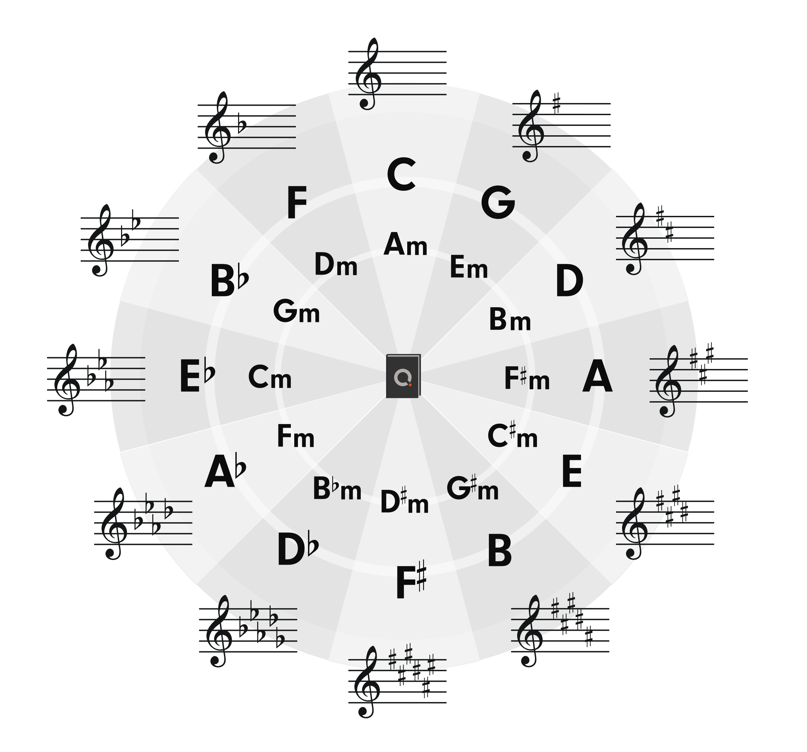

# 記事メモテンプレート

- **作成日:** 
- **最終更新:** 
- **出典 / URL:** 

---

## 概要
- 五度圏を知る。

## 目的
- 五度圏とは何かを学ぶ。

## 要点（箇条書き）
- 音階の全半を数えなくてもどこに半音記号をつければいいかすぐにわかるアイテム →五度圏 流派によっては左右がさかさまになっているタイプもある。
- 五度圏の使い方
  - 一番よくある使い方は調の名前を調べる。
  - 画像の3時の方向を例にすると、意味は楽譜に#が3つあるなら、長調はAメジャーキー、短調はF#マイナーキーを表す。
- キーの判定
  - メロディの分析時に頼りになるのが黒鍵を使っている位置と耳で感じるトーナル・センターの位置。
  - 黒鍵の位置を把握すると大まかに五度圏の何時の音かが推測できる。そこから耳で感じたトーナル・センターの音と特定したキーが一致ならほぼ間違いなしとなる。 ここまで推測すれば、メジャーキーかマイナーキーかどうかは殆ど関係ない。
  - 成功率100%ではないが、ほとんどこのやり方でキーを推測できる。

## 例 / 実践
- 実際の例や練習手順を番号付きで記載
  1. 手順A
  2. 手順B

## TODO / 次のアクション
- [ ] 次にやること1
- [ ] 次にやること2

## 関連記事・参照
- サイト: https://soundquest.jp/quest/
- 関連: 

## タグ
- #理論 #メロディ #コード #リズム

---

（このファイルをコピーして各 `memo.md` に貼り付けることで統一テンプレートとして利用できます。）